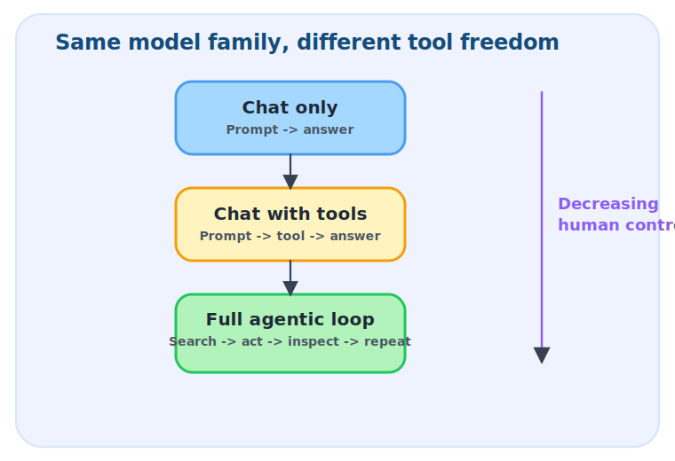
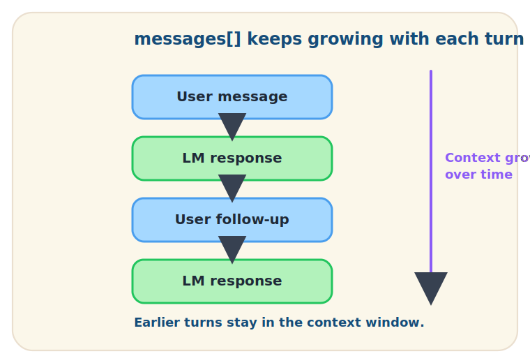
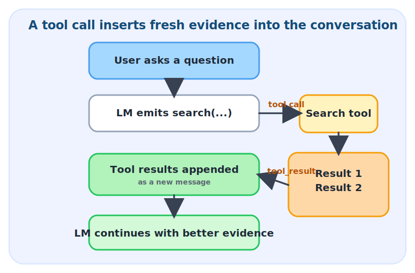
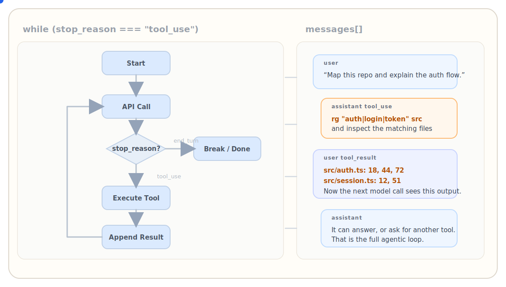
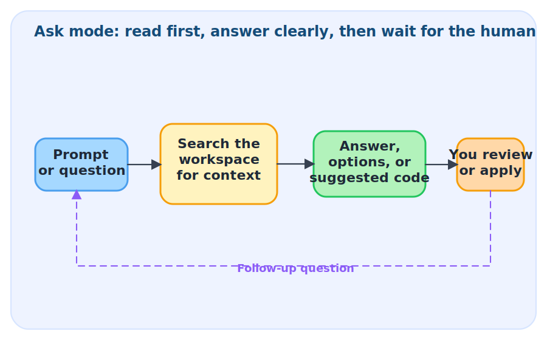
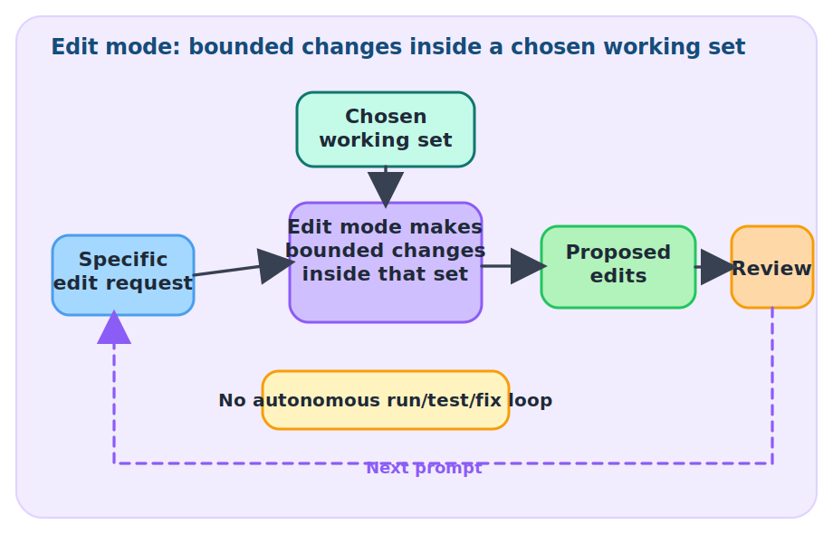
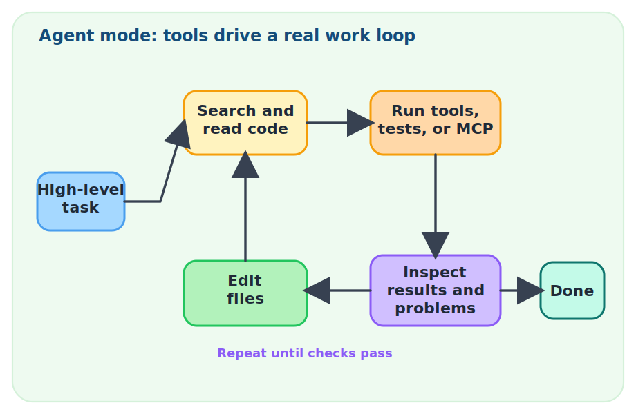
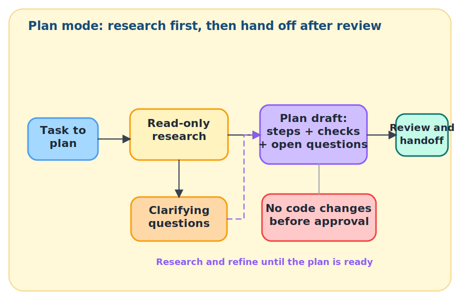

## Foundations {.center .middle}

## LLM background

LLMs are still autoregressive models: given the tokens so far, predict the next token.

:::: {.columns}
::: {.column width="62%"}
1. **Pretraining**: next-word prediction over large text and code corpora.
2. **Post-training**: chat templates, instruction tuning, and preference training turn the base model into an assistant.
3. **Recent RL progress**: on tasks with verifiable rewards, training can reinforce longer reasoning and useful tool calls.
:::

::: {.column width="38%"}
### Why it matters here

- agentic tools still run on token prediction underneath
- tools and loops change what enters context and how long the system can keep working
:::
::::

Conceptually, the progression is: next-token prediction, then chat-formatted assistance, then tool-using systems optimized for multi-step tasks.

## Context window

:::: {.columns}
::: {.column width="44%"}
At inference time, the model only sees the tokens inside its current context window.

For coding agents, search, read, inspect, and repeat is largely a context-management strategy.
:::

::: {.column width="56%"}
<ul>
  <li class="fragment fade-up" data-fragment-index="1">It is the slice of conversation, code, docs, and tool output visible right now.</li>
  <li class="fragment fade-up" data-fragment-index="2">It is not the same thing as everything stored in the model weights.</li>
  <li class="fragment fade-up" data-fragment-index="3">Dump-everything prompts are expensive, noisy, and often poorly targeted.</li>
  <li class="fragment fade-up" data-fragment-index="4">Tool use helps by finding the right context on demand, then adding only the useful pieces back.</li>
</ul>
:::
::::

## Tool calls

:::: {.columns}
::: {.column width="52%"}
A tool call is not the search itself. It is the model expressing the intention to use a tool.

- The LLM emits a structured request, often JSON-like.
- The host application checks that request against the tools it has exposed.
- The external program runs the search, command, or API call.
- The result comes back as a `tool_result` message and enters context.

This lets the system fetch relevant material when needed instead of front-loading one giant prompt.
:::

::: {.column width="48%"}
```json
{
  "tool_name": "search",
  "arguments": {
    "query": "R restricted cubic splines"
  }
}
```
:::
::::


## Three interaction patterns

:::: {.columns}
::: {.column width="46%"}
Most LLM products fit one of three interaction patterns.

- Chat only: prompt in, answer out.
- Chat with tools: the answer may pause for search or read calls.
- Full agentic loop: search, act, inspect, and repeat until a stop condition.

The practical difference is how long the system keeps control before it hands the loop back.
:::

::: {.column width="54%"}
{width=100%}
:::
::::

## Plain chat

:::: {.columns}
::: {.column width="46%"}
Plain chat is still a loop, but it is a turn-based one.

- Each new turn appends to the same conversation history.
- Earlier turns stay in `messages[]` while they still fit in the context window.
- The model can explain, compare, or draft, but it does not fetch new evidence on its own.
- The human usually decides what enters context in the first place.
:::

::: {.column width="54%"}
{width=100%}
:::
::::

## Chat with tools

:::: {.columns}
::: {.column width="46%"}
Tool use turns one model response into a small internal loop.

- The model emits a tool call such as `search("R mixed model random slopes")`.
- The search results come back as structured tool output.
- Those results are appended to the conversation as a new message.
- The next model call works from fresher, narrower context.
:::

::: {.column width="54%"}
{width=100%}
:::
::::

## Context discovery

:::: {.columns}
::: {.column width="50%"}
### Chat-only habit

- paste a long block of code, notes, and output into one prompt
- place both relevant and irrelevant material into the same large context window
- easy to waste tokens on irrelevant material
:::

::: {.column width="50%"}
### Tool-using habit

- search, read, and inspect only the relevant files or docs
- append the useful pieces as tool results when needed
- keep the active context window narrower and more task-relevant
:::
::::

For real projects, the gain is simple: discover context progressively instead of dumping everything at once.

## Full agentic loop

Search, inspect, append the result to `messages[]`, call the model again, and repeat until it can stop.



## Coding agents on different surfaces {.center .middle}

## Overview of modes in VS Code

:::: {.columns}
::: {.column width="50%"}
### Ask

- answer-first loop
- search workspace context
- stop after explanation or suggestion

### Agent

- task loop
- search, edit, run, inspect
- keep discovering context while the task unfolds
:::

::: {.column width="50%"}
### Edit

- legacy / deprecated
- edit only the chosen files
- useful when the working set is already clear

### Plan

- read-only planning loop
- research first, then draft steps and checks
- useful when touching the wrong thing too early is costly
:::
::::

The visible difference is autonomy: short answers, bounded edits, or longer task loops.

## Ask Mode

:::: {.columns}
::: {.column width="42%"}
### What it does

- read or search
- explain, compare, suggest
- stop after the answer

### Use cases

- compare `lme4::lmer()` and `glmmTMB::glmmTMB()`
- explain this `mutate()` error
:::

::: {.column width="58%"}
{width=100%}
:::
::::

## Edit Mode

:::: {.columns}
::: {.column width="42%"}
`Legacy / deprecated`

### What it does

- edit chosen files only
- keep the working set bounded
- no wider run-fix loop

### Use cases

- rename a covariate across two helpers
- update one `testthat` file only
:::

::: {.column width="58%"}
{width=100%}
:::
::::

## Agent Mode

:::: {.columns}
::: {.column width="42%"}
### What it does

- search, edit, run, inspect
- keep discovering context
- iterate until the task is done

### Use cases

- add a Shiny filter panel and wire it in
- fix failing `testthat` tests and rerun
:::

::: {.column width="58%"}
{width=100%}
:::
::::

## Plan Mode

:::: {.columns}
::: {.column width="42%"}
### What it does

- stay read-only first
- ask for missing context
- draft steps, checks, and risks

### Use cases

- plan a base-to-`ggplot2` migration
- break a Shiny refactor into stages
- map risks before touching GxP code
:::

::: {.column width="58%"}
{width=100%}
:::
::::

## Positron

For many RStudio users, Positron is the most natural next surface.

- Start here if you want an IDE that still feels centered on the `Console`, `Variables Pane`, `Plots Pane`, `Help`, and `Data Explorer`.
- Positron Assistant keeps the VS Code-like surfaces: `Chat`, inline chat, code completions, and quick Console error fixes.
- The useful extra context is session-native: attached `Interpreter Sessions…`, Console inputs and outputs, in-memory objects in the `Variables Pane`, and the active plot in the `Plots Pane`.
- From the paperclip menu, you can attach `Files & Folders`, `Interpreter Sessions…`, `Source Control…`, and `Tools`.
- If your work is exploratory R analysis, Quarto, or Shiny, Positron is often the easiest place to keep the agent grounded in the live session.

## Copilot CLI

Copilot CLI is maximum power in a terminal interface.

- It is the most general surface for file access, shell commands, logs, renders, builds, git, and long-running tasks.
- Once you trust a folder, it can read, modify, and execute within that directory tree, so this is the place where you impose the least control.
- It is a strong fit for `renv`, `targets`, Quarto renders, shell-heavy workflows, and repository maintenance.
- It exposes the more agentic building blocks directly: autopilot mode, trusted directories, tool approvals, custom agents, skills, hooks, and MCP.
- It is excellent for getting work done, but it is a weaker place to review code carefully; after a substantial task, switch back to the IDE for diff review and cleanup.

## Constructing closed feedback loops

This is the main usage trick with coding agents: give them a loop that can tell them whether they are getting warmer or colder.

- The basic pattern is `edit -> run -> inspect -> fix`.
- Agents are strongest when the task has a fast local signal: tests, parser checks, linting, Quarto renders, app startup, or a script that reproduces a plot or table.
- In R work, that can mean `testthat`, a Quarto render, a Shiny launch, or a reproducible analysis script.
- One practical pattern is test-first: ask for a failing test or a minimal reproduction, then let the agent iterate until it passes.
- After the code works, use a separate pass for refactoring. Correctness first; abstraction second.

## Turn-based vs task-based

- Turn-based work is still useful for explanation, comparison, and bounded edits.
- Task-based work starts with a goal, a stop condition, and some boundaries.
- The agent then keeps the loop until it finishes, gets blocked, or hits a review point.
- Human effort shifts upward: less syntax steering, more task framing, statistical judgment, and review.

## Workflow building blocks

- **Custom instructions**: reusable repo or team guidance
- **Skills**: task-specific instructions, scripts, or resources
- **Subagents / custom agents**: bounded helper roles
- **Hooks**: automatic checks before or after key events

The names vary by product, but the intuition is stable: instructions shape behavior, skills add know-how, subagents split work, and hooks enforce process.

## Main limitation

**LLMs write at inference speed; humans review at human speed.**

- They are fast at syntax, boilerplate, and glue code.
- They are still weak at designing abstractions and noticing when the local pattern is the wrong pattern to repeat.
- Complexity can pile up faster than a human can review it.
- Wrong retrieval still produces wrong code, just faster.

## Boundaries

- Keep GxP and other regulated workflows behind explicit rules.
- Choose tool access, model providers, and context attachments deliberately.
- Review has to remain a real control, not a ritual.
- Long contexts and repeated loops cost money.
- Use the agentic loop where the feedback signal is strong enough to buy real leverage.

## Where to start

- Plots, tables, Quarto snippets, and Shiny prototypes.
- Git operations, repository exploration, package documentation, `renv`, and `targets`.
- Frame the statistical task clearly; let the model handle more of the syntax.
- For this audience, the main gain is faster iteration around research tasks that still have a clear human owner.

## Closing

- Use agents as leverage, not as a substitute for judgment.
- Keep ownership of the statistical question, the boundaries, and the review.
- Build a workflow through curiosity-led experimentation.

## References

:::: {.columns}
::: {.column width="50%"}
Core concepts:

- [learn-claude-code repository](https://github.com/shareAI-lab/learn-claude-code)
- [learn-claude-code interactive s01](https://learn.shareai.run/en/s01/)
- [VS Code local agents](https://code.visualstudio.com/docs/copilot/agents/local-agents)
- [VS Code workspace context](https://code.visualstudio.com/docs/copilot/reference/workspace-context)
- [January 2026 VS Code update](https://code.visualstudio.com/updates/v1_109)
:::

::: {.column width="50%"}
Product surfaces:

- [Positron Assistant](https://positron.posit.co/assistant)
- [Positron Chat](https://positron.posit.co/assistant-chat.html)
- [Positron Completions](https://positron.posit.co/assistant-completions.html)
- [Positron Getting Started](https://positron.posit.co/assistant-getting-started.html)
- [GitHub Copilot CLI overview](https://docs.github.com/copilot/concepts/agents/about-copilot-cli)
- [Using GitHub Copilot CLI](https://docs.github.com/en/copilot/how-tos/copilot-cli/use-copilot-cli-agents/overview)
- [About agent skills](https://docs.github.com/en/copilot/concepts/agents/about-agent-skills)
- [About hooks](https://docs.github.com/en/copilot/concepts/agents/coding-agent/about-hooks)
:::
::::
